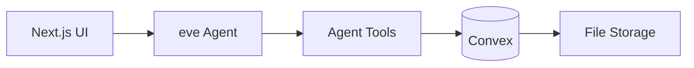

# Architecture

## High-level flow



1. User uploads a resume and starts an analysis from `/analyze`.
2. The eve agent loads the `analyze-match` skill and calls tools in order.
3. Results are persisted to Convex and shown on the dashboard and report page.

## Agent layout

```
agent/
├── instructions.md       # System prompt
├── skills/               # Playbooks (analyze-match, tailor-cv, …)
├── tools/                # parse_resume, score_match, save_analysis, …
└── lib/                  # Effect runners, Convex client
```

### Analysis pipeline

| Step | Tool | Purpose |
|------|------|---------|
| 1 | `parse_resume` | Extract text from PDF/DOCX in Convex storage |
| 2 | `fetch_job_posting` | Fetch & clean job URL (if applicable) |
| 3 | `update_job_posting` | Persist fetched title + text |
| 4 | `score_match` | LLM scoring: match %, skills, recommendations |
| 5 | `save_analysis` | Write to `analyses` table |

## Convex schema

| Table | Purpose |
|-------|---------|
| `users` | Auth users (Convex Auth + Password) |
| `resumes` | CV files, versions, parsed text |
| `jobPostings` | Job text/URL, extracted title |
| `analyses` | Match results, optional `previousAnalysisId` for re-scores |
| `applications` | Tracker kanban status per analysis |
| `artifacts` | Tailored bullets, cover letters, learning plans |
| `rateLimits` | Daily analysis quota |

## Shared schemas

Zod contracts in `lib/schemas/tools.ts` are shared between agent tools and documentation — keeping tool inputs/outputs type-safe.

## Authentication

[Convex Auth](https://labs.convex.dev/auth) with the Password provider. The app uses `ConvexAuthProvider` and server-side `requireUserId()` in all Convex functions.
