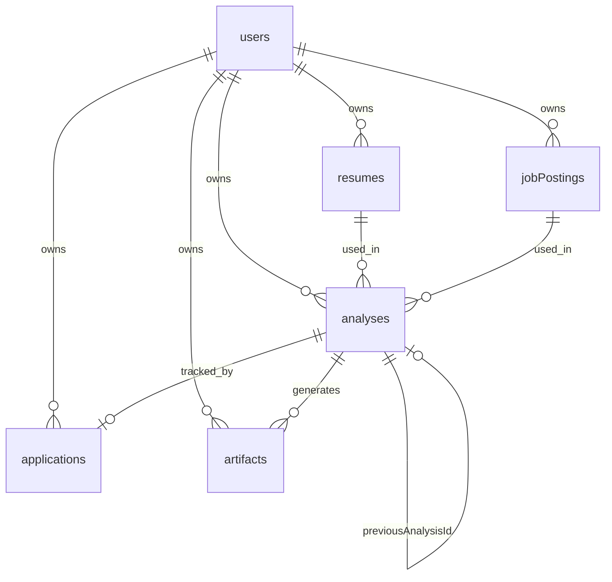

# Data model

Convex schema (`convex/schema.ts`).

## Entity relationship

## Tables

### `users`

Auth profile + optional `externalId` for legacy migration. Indexes: `email`, `phone`, `by_external_id`.

### `resumes`

| Field | Type | Notes |
|-------|------|-------|
| storageId | `_storage` | Convex file storage |
| fileName, mimeType | string | Original upload |
| parsedText | string? | Filled by parse_resume |
| version | number | Incrementing per user |
| isActive | boolean | One active per user |

### `jobPostings`

| Field | Type | Notes |
|-------|------|-------|
| source | `text` \| `url` | Input method |
| rawText, cleanedText | string | Job content |
| title | string? | Auto-extracted or from fetch |
| url | string? | When source is url |

### `analyses`

Match results + optional `previousAnalysisId` for re-scores. Indexes by user, created date, match %.

### `applications`

Tracker kanban: `saved` | `applied` | `interview` | `offer`. One per analysis (unique by analysisId).

### `artifacts`

| type | content shape |
|------|----------------|
| `tailored_bullets` | `{ bullets: [{ original, rewritten, rationale? }] }` |
| `cover_letter` | `{ coverLetter: string }` |
| `learning_plan` | `{ plans: [{ skill, durationWeeks, steps[] }] }` |

### `rateLimits`

`(userId, date)` → `analysisCount` for daily quota.

## Auth tables

Included via `authTables` from `@convex-dev/auth/server`.

[Convex API →](../reference/convex-api)
