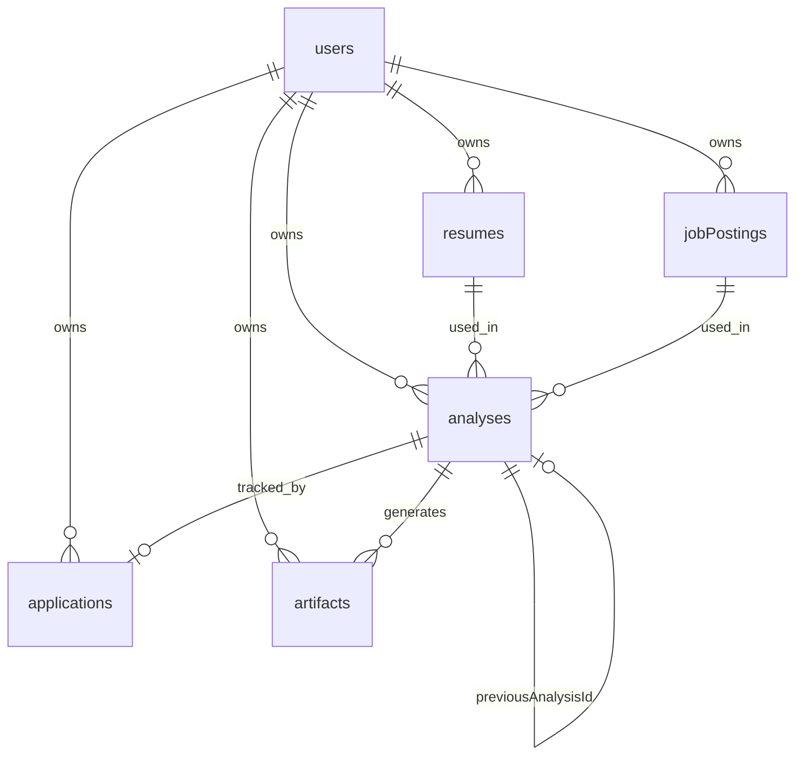

# Data model

Convex schema (`convex/schema.ts`).

## Entity relationship

```mermaid
erDiagram
  users ||--o{ resumes : owns
  users ||--o{ jobPostings : owns
  users ||--o{ analyses : owns
  users ||--o{ applications : owns
  users ||--o{ artifacts : owns
  resumes ||--o{ analyses : used_in
  jobPostings ||--o{ analyses : used_in
  analyses ||--o| analyses : previousAnalysisId
  analyses ||--o| applications : tracked_by
  analyses ||--o{ artifacts : generates
```

## Tables

### `users`

Clerk-mapped profile: `externalId` (Clerk subject), optional `email` / `name` / `image`. Indexes: `email`, `by_external_id`.

### `resumes`

| Field | Type | Notes |
|-------|------|-------|
| storageId | `_storage` | Convex file storage |
| fileName, mimeType | string | Original upload |
| parsedText | string? | Filled by parse_resume |
| version | number | Incrementing per user |
| isActive | boolean | One active per user |

### `jobPostings`

| Field | Type | Notes |
|-------|------|-------|
| source | `text` \| `url` | Input method |
| rawText, cleanedText | string | Job content |
| title | string? | Auto-extracted or from fetch |
| company, location, salary | string? | Heuristics + JSON-LD when fetching URLs |
| url | string? | When source is url |

### `analyses`

Match results + optional `previousAnalysisId` for re-scores. Indexes by user, created date, match %.

When `analyses.create` runs (via `save_analysis`), it also inserts an `applications` row with status `saved` if one does not already exist for that analysis.

### `applications`

Tracker kanban: `saved` | `applied` | `interview` | `offer` | `rejected`. One per analysis (unique by analysisId).

Optional `notes`, `followUpAt` (auto-set on Applied / Interview). Indexes: `by_user`, `by_user_status`, `by_analysis`, `by_user_follow_up`.

### `artifacts`

| type | content shape |
|------|----------------|
| `tailored_bullets` | `{ bullets: [{ original, rewritten, rationale? }] }` |
| `cover_letter` | `{ coverLetter: string }` |
| `learning_plan` | `{ plans: [{ skill, durationWeeks, steps[] }] }` |
| `interview_prep` | `{ opener?, questions: [{ question, category, whyAsked, tip }] }` |
| `tailored_cv` | `{ headline, summary, experience: [{ heading, bullets[] }], skills[] }` |

### `rateLimits`

`(userId, date)` → `analysisCount` for daily quota.

## Auth

Sessions live in **Clerk**. Convex `users` rows map via `externalId` (Clerk subject). See [Authentication](../concepts/authentication).

[Convex API →](../reference/convex-api)
