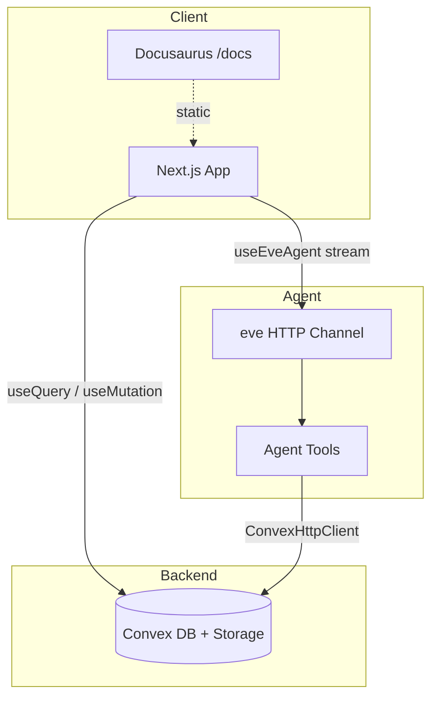

# System overview

JobFit AI is a full-stack agent app: Next.js UI, eve agent, Convex backend.



## Responsibilities

| Layer | Role |
|-------|------|
| **Next.js** | UI, auth gate, real-time Convex subscriptions |
| **eve** | Agent orchestration, tool execution, streaming |
| **Convex** | Auth, file storage, analyses, tracker, artifacts |
| **Docusaurus** | Static documentation at `/docs` |

## Key directories

```
agent/     instructions, skills, tools (Effect pipelines)
app/       Next.js App Router pages
convex/    Schema, queries, mutations
lib/       Shared Zod schemas for tools
website/   Docusaurus source
```

## Request paths

**Analysis run:** Browser → `agent.send()` → eve → tools → Convex → stream back → UI updates via Convex subscription when analysis is saved.

**Dashboard:** Convex `analyses.listByUser` with joined resume + job posting.

[Agent pipeline →](./agent-pipeline) · [Data model →](./data-model)
