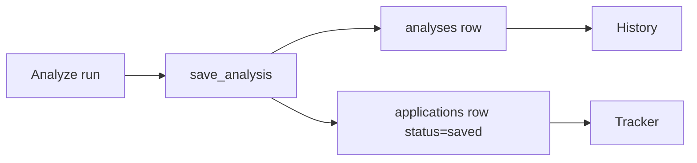

# History vs Tracker

Two different views of the same job search — don't confuse them.

## Side by side

| | **History** | **Tracker** |
|--|-------------|-------------|
| Route | `/` | `/tracker` |
| Question it answers | “What did I score?” | “Where am I in the process?” |
| Convex table | `analyses` | `applications` |
| Primary UI | Filterable analysis cards | Kanban columns |
| Created when | `save_analysis` succeeds | Same save (auto) + optional manual create |

## When something is “missing”

| Symptom | Likely cause |
|---------|----------------|
| History empty, analysis “felt” done | Save failed (toast / agent error) — re-run Analyze |
| History has the report, Tracker empty | Older analyses before auto-track — open report and Save to tracker, or re-run |
| Tracker has a card, History missing | Unexpected — History is the source of truth for scores; check Convex logs |

## Mental model

- **History** = library of match reports (immutable scores unless you re-score)  
- **Tracker** = workflow status for roles you care about  

You can have many History entries you never actively track beyond the default Saved card. You should not expect Tracker to invent rows without an analysis.

Follow-up dates live on **Tracker** cards only (`applications.followUpAt`). History never stores reminders. See [Follow-up notifications](../user-guide/tracker#follow-up-notifications).

## Related

- [Dashboard](../user-guide/dashboard)  
- [Tracker](../user-guide/tracker)  
- [Data model](../architecture/data-model)  
