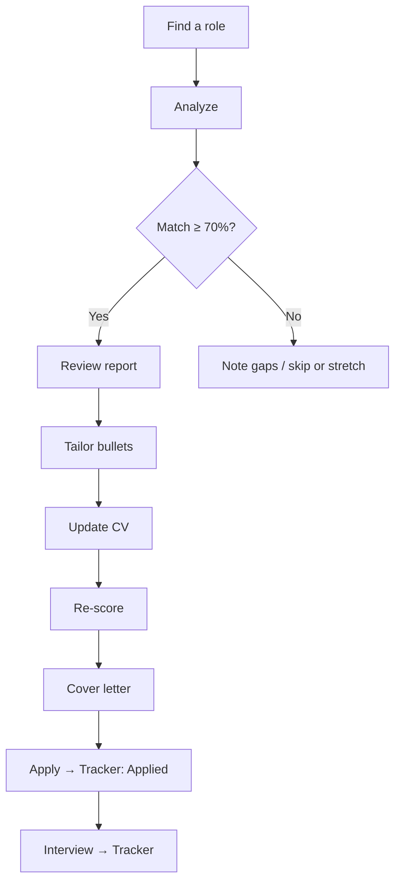

# Recommended workflow

A practical loop for job searching with JobFit AI.

## Daily loop

### 1. Analyze every serious role

Paste the full posting on **Analyze**. Don't rely on the title alone — the agent needs requirements text to score honestly.

### 2. Triage with History filters

On **History**:

- Filter **≥ 85%** for strong fits to prioritize  
- Filter **≥ 70%** for good fits worth tailoring  
- Use **Compare** when two roles look similar  

### 3. Close gaps before applying

On the report:

1. Read **Missing skills** and **Recommendations**  
2. Run **Tailor bullets** — copy verified rewrites into your CV  
3. Upload the revised CV and **Re-score** to confirm the delta  
4. Generate a **Cover letter** from the improved match  

### 4. Track the pipeline

Cards land in **Saved** when an analysis saves. Drag them:

| Stage | When |
|-------|------|
| **Saved** | Interesting, not applied yet |
| **Applied** | Application submitted |
| **Interview** | Screening / onsite |
| **Offer** | Offer or negotiation |

### 5. Learn from patterns

- If many roles show the same missing skill → run **Learning plan** once and invest a week  
- If seniority is often **Below target**, highlight leadership / ownership bullets  
- If titles show as vague fallbacks, improve how you paste jobs ([Role titles](../concepts/role-titles))  

## What not to do

- Don't treat match % as a guarantee of an interview — it's a fit signal, not a recruiter decision  
- Don't paste agent-rewritten bullets without verifying employers, dates, and metrics  
- Don't expect URL fetch to work on login-walled job boards — paste text instead  

## Related

- [First analysis](./first-analysis)  
- [Matching scores](../concepts/matching-scores)  
- [Career tools](../user-guide/career-tools)  
- [Tracker](../user-guide/tracker)  
