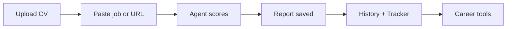

import Link from '@docusaurus/Link';

# JobFit AI Documentation

Match your resume to any role — with honest scoring, actionable feedback, and career tools powered by AI.

  

    

      
<h3>Getting started</h3>

      

        
Install locally and run your first analysis in minutes.

      

      

        <Link className="button button--primary button--block" to="/getting-started/installation">Install →</Link>
      

    

  

  

    

      
<h3>User guide</h3>

      

        
Every screen: history, analyze, tracker, career tools.

      

      

        <Link className="button button--secondary button--block" to="/user-guide/dashboard">Explore →</Link>
      

    

  

  

    

      
<h3>Reference</h3>

      

        
Agent tools, Convex API, env vars, deployment.

      

      

        <Link className="button button--secondary button--block" to="/reference/agent-tools">Reference →</Link>
      

    

  

## What JobFit AI does

| Capability | What you get |
|------------|--------------|
| **Match analysis** | Resume vs job posting → match %, skills, red flags, recommendations |
| **History** | Filterable list of every saved report with compare |
| **Tracker** | Kanban (Saved → Offer) with drag-and-drop; auto-added on save |
| **Career tools** | Tailored CV, bullets, cover letter, learning plan, interview prep, application pack |
| **Follow-ups** | Toolbar bell + optional browser alerts when Applied / Interview dates are due |
| **Batch analyze** | Queue several pastes (`---`) or URLs (one per line) |
| **Re-score** | Upload a revised CV and see the match % delta |

## How a match works

1. Upload a PDF/DOCX resume  
2. Paste a job description, drop an HTTPS URL, or **batch** several postings on **Analyze**  
3. The eve agent parses, scores, and saves (title / company / location / salary when present)  
4. Open the report from **History**; the role also lands in **Tracker**  
5. Optionally generate a tailored CV, pack the application, or re-score after edits  

[Full walkthrough →](./getting-started/first-analysis) · [Recommended workflow →](./getting-started/recommended-workflow)

## History vs Tracker

| | **History** (`/`) | **Tracker** (`/tracker`) |
|--|-------------------|--------------------------|
| Purpose | All match reports | Application pipeline |
| Data | `analyses` | `applications` |
| When filled | Every successful `save_analysis` | Auto-created on save (Saved column) |

[History vs Tracker explained →](./concepts/history-vs-tracker)

## Stack

| Layer | Technology |
|-------|------------|
| Frontend | Next.js 16, shadcn/ui, Tailwind v4, TipTap |
| Agent | [eve](https://eve.dev) + OpenAI GPT-4.1 |
| Backend | [Convex](https://convex.dev) (auth, storage, realtime) |
| Docs | [Docusaurus](https://docusaurus.io/) 3 |

## Quick links

| Topic | Link |
|-------|------|
| First analysis | [Getting started →](./getting-started/first-analysis) |
| How scoring works | [Matching scores →](./concepts/matching-scores) |
| Why “Untitled role”? | [Role titles →](./concepts/role-titles) |
| Company / location / salary | [Job metadata →](./concepts/job-metadata) |
| System architecture | [Overview →](./architecture/overview) |
| Environment variables | [Reference →](./reference/environment-variables) |
| Deploy | [Production →](./deployment/production) |
| FAQ | [Help →](./help/faq) |

<a className="button button--primary button--lg margin-top--md" href="/">Open JobFit AI App →</a>
