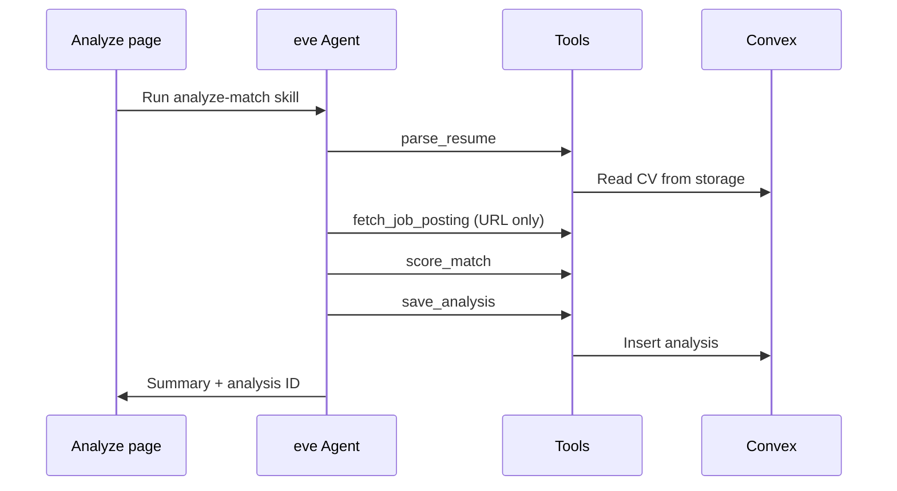

# Analyze

Route: `/analyze`

Start a new resume vs. job match analysis.

## Before you start

You need an **active resume**. If none exists, you'll see a getting-started prompt linking to **Resumes**.

## Job input modes

### Paste text

Paste the full job description — requirements, responsibilities, nice-to-haves. Job title is auto-extracted from the first lines when possible.

### URL

Provide an **HTTPS** URL. The agent:

1. Fetches the page server-side
2. Strips HTML and sanitizes content
3. Persists cleaned text + title via `update_job_posting`

:::caution
Some job boards block scraping or require login. If fetch fails, paste the text manually.
:::

## Live agent stream

The right panel streams eve agent messages and tool calls in real time. Typical pipeline:

## Rate limit

Each user gets **20 analyses per day**. If exceeded, you'll see a toast and the run won't start.

[Matching scores explained →](../concepts/matching-scores)
