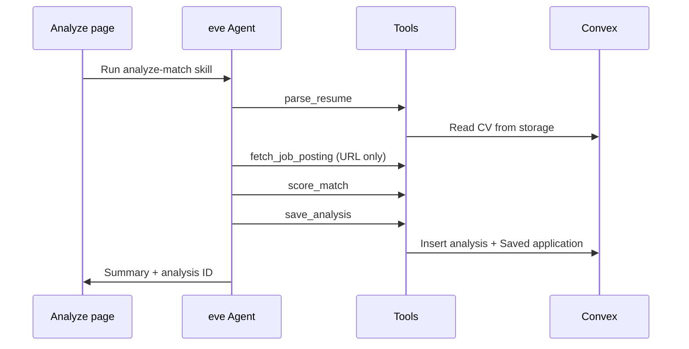

# Analyze

Route: `/analyze`

Start a new resume vs. job match analysis.

## Layout

| Panel | Purpose |
|-------|---------|
| **Setup** (left) | Active resume, job editor / URL, Run analysis |
| **Progress** (right) | Step pipeline + compact agent status while running |

When idle, the progress panel explains what will happen. During a run it tracks parse → score → save (and fetch for URLs).

## Before you start

You need an **active resume**. If none exists, you'll see a prompt linking to **Resumes**.

## Job input modes

### Paste text (default)

Use the rich text editor to paste the full job description — requirements, responsibilities, nice-to-haves. Content is sent to the agent as plain text.

:::tip Clearer History labels
Put the **job title on the first line**. JobFit extracts titles from the top of the paste when possible. See [Role titles](../concepts/role-titles).
:::

### URL

Provide an **HTTPS** URL. The agent:

1. Fetches the page server-side  
2. Strips HTML and sanitizes content  
3. Persists cleaned text + title via `update_job_posting`  

:::caution
Some job boards block scraping or require login. If fetch fails, paste the text manually.
:::

## What happens on Run

```mermaid
sequenceDiagram
  participant UI as Analyze page
  participant Agent as eve Agent
  participant Tools as Tools
  participant DB as Convex

  UI->>Agent: Run analyze-match skill
  Agent->>Tools: parse_resume
  Tools->>DB: Read CV from storage
  Agent->>Tools: fetch_job_posting (URL only)
  Agent->>Tools: score_match
  Agent->>Tools: save_analysis
  Tools->>DB: Insert analysis + Saved application
  Agent->>UI: Summary + analysis ID
```

On successful save:

1. Toast confirms the analysis was stored  
2. The report appears under **History**  
3. An application card is created under **Tracker → Saved**  

## Rate limit

Each user gets **20 analyses per day**. If exceeded, you'll see a toast and the run won't start.

[Matching scores →](../concepts/matching-scores) · [Troubleshooting →](../help/troubleshooting)
